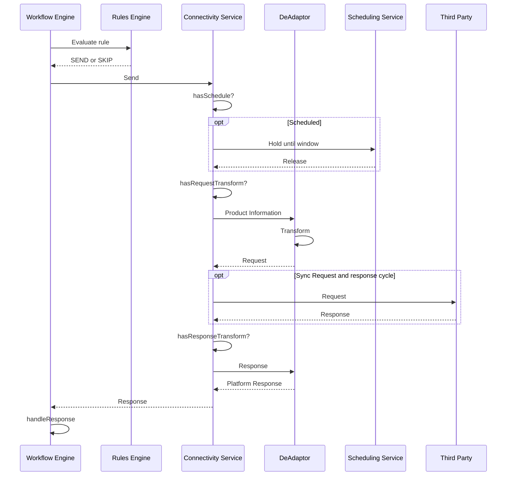
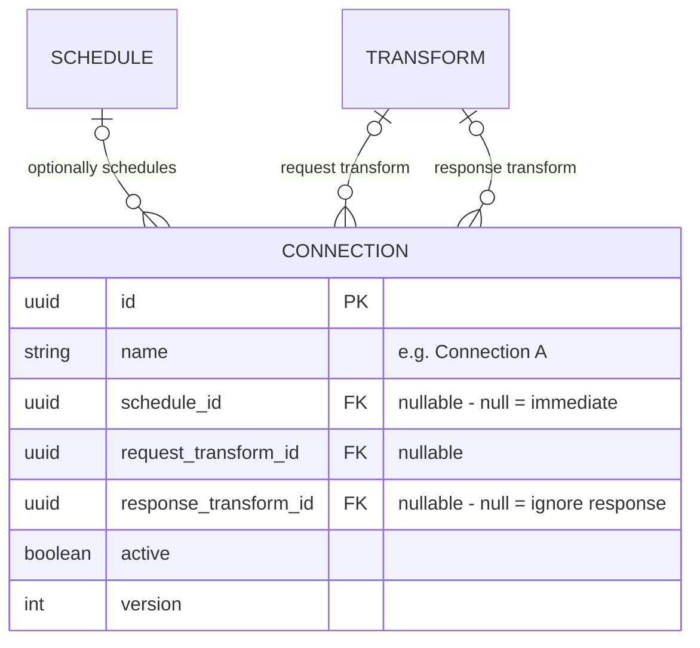

# Connectivity Service – Solution Design (Mock)

# Narrative

**Problem**
Operators ran product workflows such as issuance. Each workflow had to notify a growing set of third parties, and every client wanted their own. Each integration was bespoke code that reinvented scheduling, payload formatting and error handling. That took 5–6 days of development per connection, and every connection failed differently for the operators running the workflows.

**Decision**
Separate *whether* something is sent, *how* it is shaped, and *when and how* it is delivered:
- **Rules Engine** decides from product data whether a workflow triggers a connection.
- **Decentralised Adaptor layer** is owned by a dedicated payload transformation team that ships independently.
- **Connectivity Service** owns delivery, scheduling and error handling.

**Key idea: build each capability once, combine them through config**
Each capability is built once: polling, batching, sync and async delivery, and scheduling rules such as "send on the product's issue date". After that, a connection is just a combination of existing capabilities. A Connectivity Admin configures it and can change it at runtime. Every interaction is gated by our standard RBAC (role-based access control), and every change is versioned and audited.

**Results**
- **62 connections** delivered across three clients: 47 for our largest client, 11 and 4 for two others.
- Development time per connection cut from **5–6 days to at most 1 day**. That saved roughly **250–310 engineer-days** (over an engineer-year), and the saving grows with every new connection.
- **Consistent operator experience:** delivery, retries and errors behave the same for every connection, so operators running issuance and other workflows see one pattern.
- A new *kind* of capability is a one-off cost. A new *connection* is almost free, so growth no longer scales with engineering headcount.

# High level Requirements

- **As A** Workflow Operator
- **When** I progress through the "Issuance" workflow 
- **I expect** certain connections to be activated as part of "The Issuance process" depending on the product data

for Example
**When** A CLN product   
**Then** The workflow should send out connections A,B

**When** A product is public offer  
**Then** The workflow should send out connections D,E

Connection Level Requirements 
Connection A
- Must be Sent on Product Issue Date
- Must transform the product payload into requestFormatA
- Must transform the response into a analyticsResponseA 

Connection B
- Must be Sent on at 2AM German time on day of sending 
- Must transform the product payload into requestFormatB
- Must transform the response into a analyticsResponseB

Connection C
- Must be Sent immediately 
- Must transform the product payload into requestFormatC
- Must transform the response into a analyticsResponseC

Connection D
- Must be Sent immediately 
- Must transform the product payload into requestFormatC
- ignore the response 

## Connection dispatch flow - Simplified

## Connection configuration data model

### Example configuration ()

| Connection | Triggered by rule | Schedule                       | Request transform | Response transform |
| ---------- | ----------------- | ------------------------------ | ----------------- | ------------------ |
| A          | IsCLN             | PRODUCT_DATE (issueDate)       | requestFormatA    | analyticsResponseA |
| B          | IsCLN             | FIXED_TIME 02:00 Europe/Berlin | requestFormatB    | analyticsResponseB |
| C          | –                 | null (immediate)               | requestFormatC    | analyticsResponseC |
| D          | IsPublicOffer     | null (immediate)               | requestFormatC    | null (ignore)      |
